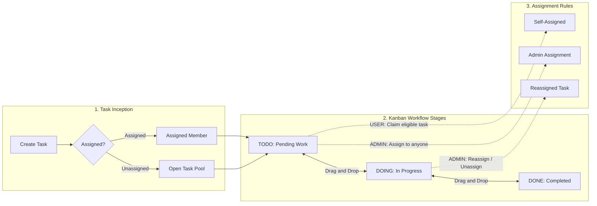
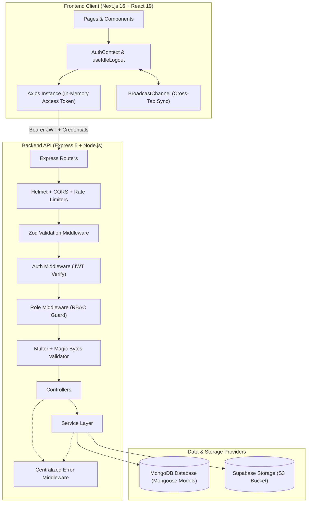
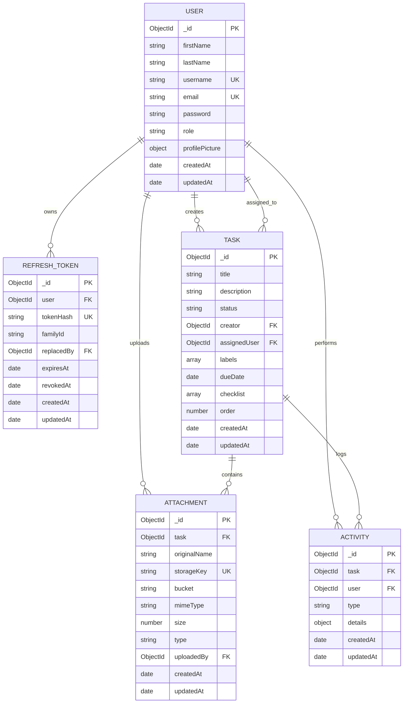

# TaskFlow

TaskFlow is a modern, full-stack task management platform built with Next.js, Express, TypeScript, and MongoDB. Inspired by Kanban workflows, it enables teams to plan, assign, track, and deliver work with role-based access control, drag-and-drop board interactions, secure session authentication, and cloud-backed file attachments.


---

## Table of Contents

- [Overview](#overview)
- [Features](#features)
- [User Roles & RBAC Matrix](#user-roles--rbac-matrix)
- [Task Workflow](#task-workflow)
- [Tech Stack](#tech-stack)
- [System Architecture](#system-architecture)
- [Project Structure](#project-structure)
- [Authentication & Security](#authentication--security)
- [Idle Session Timeout](#idle-session-timeout)
- [Task Attachments & Cloud Storage](#task-attachments--cloud-storage)
- [Profile Management](#profile-management)
- [API Overview](#api-overview)
- [API Request & Response Examples](#api-request--response-examples)
- [Database Design](#database-design)
- [Environment Variables](#environment-variables)
- [Local Development](#local-development)
- [Docker](#docker)
- [Deployment](#deployment)
- [CORS Configuration](#cors-configuration)
- [Error Handling](#error-handling)
- [Server-Side Pagination](#server-side-pagination)
- [Testing](#testing)
- [Screenshots](#screenshots)
- [Demo Credentials](#demo-credentials)
- [Future Improvements](#future-improvements)
- [Contributing](#contributing)
- [License](#license)
- [Author & Submission Information](#author--submission-information)

---

## Overview

TaskFlow is designed to solve organizational bottlenecks for agile product and engineering teams. It replaces scattered task lists and communication silos with a single source of truth:

- **Collaborative Kanban Board**: Visualize work across `TODO`, `DOING`, and `DONE` stages with real-time optimistic state updates and vertical prioritization.
- **Strict Role-Based Security**: Clear separation between standard workspace members (`USER`) and administrators (`ADMIN`). Backend authorization serves as the immutable source of truth.
- **Controlled Task Delegation**: Normal users can create tasks and assign eligible unassigned tasks to themselves, while administrators maintain global assignment, reassignment, and oversight authority.
- **End-to-End Auditability**: Every task update, status shift, assignment change, and file upload is recorded in an activity feed with timestamps and user attribution.
- **Hardened Session Security**: Dual-token JWT architecture with atomic refresh-token rotation, token reuse detection, idle session timeout, and cross-tab logout synchronization.

---

## Features

### Authentication & Authorization
- [x] User registration with live password complexity validation (min 8 chars, uppercase, lowercase, number, special character)
- [x] Secure email/password login with rate limiting protection
- [x] Dual-token JWT authentication (short-lived access tokens + long-lived refresh tokens)
- [x] Refresh-token rotation with family IDs and concurrency grace window handling
- [x] Token reuse detection that invalidates compromised token families
- [x] In-memory access token storage to prevent persistent browser storage theft
- [x] Secure `HttpOnly`, `SameSite=Lax` cookie configuration for refresh tokens
- [x] Role-Based Access Control (`USER` and `ADMIN` roles)
- [x] Synchronized cross-tab session termination via `BroadcastChannel`
- [x] Configurable client-side idle inactivity timeout with countdown warning modal

### Task Management & Kanban Board
- [x] Interactive Kanban board with three core workflow states (`TODO`, `DOING`, `DONE`)
- [x] Drag-and-drop status transitions powered by `@dnd-kit`
- [x] Vertical order sorting within columns to prioritize urgent tasks
- [x] Task detail modal with rich description editing, due dates, and checklist items
- [x] Label tagging system (Bug, Feature, Urgent, Enhancement, Design, In Review, Docs)
- [x] Task assignment workflow: self-assignment by team members; global assignment by administrators
- [x] Task deletion controls (task creators and administrators only)
- [x] Task cover image detection and card preview display

### Task Attachments & Evidence
- [x] File uploads supporting Images (JPEG, PNG, WEBP up to 5 MB) and Documents (PDF up to 10 MB)
- [x] File signature (magic bytes) verification to prevent extension spoofing
- [x] Secure storage backed by Supabase Storage / S3-compatible object store
- [x] Presigned URL generation (1-hour expiry) for private file download and viewing
- [x] Attachment deletion with automated cloud object cleanup
- [x] Attachment indicator on Kanban cards

### Activity Feed & Collaboration
- [x] Comprehensive audit trail tracking creations, status changes, updates, assignments, and file events
- [x] Comment system allowing team members to communicate directly on tasks
- [x] User avatar thumbnail integration in activity streams

### User & Profile Management
- [x] Profile information view and update (First Name, Last Name, Username, Email)
- [x] Secure password change with automatic revocation of all existing refresh token sessions
- [x] Profile picture upload and deletion with image signature validation and old file cleanup
- [x] User avatars displayed across header, Kanban cards, modal views, and audit feeds

### Administration
- [x] Dedicated Admin Dashboard with real-time aggregate statistics
- [x] User management table with server-side pagination, search, and role filtering
- [x] Administrative user account editing (names, username, email, role promotion/demotion)
- [x] Administrative user account deletion with safety guards (prevents self-deletion; unassigns assigned tasks)
- [x] Administrative task management table with status filtering and reassignment modal

---

## User Roles & RBAC Matrix

TaskFlow enforces strict Role-Based Access Control (RBAC). All permissions are verified on the backend before any database mutation occurs.

| Capability | Standard Member (`USER`) | Administrator (`ADMIN`) | Enforcement Layer |
|:---|:---:|:---:|:---|
| Register Account | Allowed | Allowed | `POST /api/auth/register` |
| Sign In / Sign Out | Allowed | Allowed | `POST /api/auth/login`, `POST /api/auth/logout` |
| View Board & Tasks | Allowed | Allowed | `GET /api/tasks`, `GET /api/tasks/:id` |
| Create Task | Allowed (self-assign only) | Allowed (assign to anyone) | `POST /api/tasks` |
| Update Task Details | Own / Assigned tasks | Any task | `PATCH /api/tasks/:id` |
| Assign Unassigned Task to Self | Allowed | Allowed | `PATCH /api/tasks/:id/assignment` |
| Assign Task to Other Users | Forbidden (403) | Allowed | `PATCH /api/tasks/:id/assignment` |
| Reassign Already Assigned Tasks | Forbidden (403) | Allowed | `PATCH /api/tasks/:id/assignment` |
| Unassign Tasks | Forbidden (403) | Allowed | `PATCH /api/tasks/:id/assignment` |
| Delete Task | Creator only | Any task | `DELETE /api/tasks/:id` |
| Reorder Column Tasks | Own assigned tasks | All tasks | `PATCH /api/tasks/reorder` |
| Upload Task Attachment | Creator / Assignee | Allowed | `POST /api/tasks/:id/attachments` |
| Delete Task Attachment | Uploader / Creator | Allowed | `DELETE /api/tasks/:id/attachments/:aid` |
| View Admin Dashboard & Stats | Forbidden (403) | Allowed | `GET /api/admin/stats` |
| View All Users List | Forbidden (403) | Allowed | `GET /api/users` |
| Edit User Account / Role | Forbidden (403) | Allowed | `PATCH /api/users/:id` |
| Delete User Account | Forbidden (403) | Allowed (excluding self) | `DELETE /api/users/:id` |
| Manage Own Profile & Password | Allowed | Allowed | `PATCH /api/users/me/*` |

---

## Task Workflow

TaskFlow follows an agile Kanban lifecycle with three standardized stages:



1. **Creation**: Any authenticated user can create a task with title, rich description, labels, due date, and checklist items.
2. **Assignment**: Normal users can only assign eligible unassigned tasks to themselves. Administrators can assign, reassign, or unassign any task across all users.
3. **Execution**: Assignees progress tasks across `TODO`, `DOING`, and `DONE` via drag-and-drop or status selectors.
4. **Audit Trail**: Every state transition generates an immutable activity log entry with timestamp and actor attribution.

---

## Tech Stack

| Layer | Technology | Version | Purpose |
|:---|:---|:---|:---|
| **Frontend Framework** | Next.js (App Router) | 16.3.4 | React application framework and SSR |
| **UI Library** | React | 19.2.8 | Declarative component interface |
| **Language (Frontend)** | TypeScript | ^5.0.0 | Static typing and interface safety |
| **Styling** | Tailwind CSS | ^4.0.0 | Utility-first responsive design |
| **Drag & Drop** | `@dnd-kit/core`, `@dnd-kit/sortable` | ^6.3.1 / ^10.0.0 | Accessible Kanban drag-and-drop reordering |
| **Icons** | Lucide React | ^1.43.0 | Modern SVG icon system |
| **HTTP Client** | Axios | ^1.20.0 | REST API requests and request interceptors |
| **Backend Framework** | Express.js | ^5.2.1 | REST API application framework |
| **Runtime** | Node.js | >= 20 | Server JavaScript runtime |
| **Language (Backend)** | TypeScript | ^7.0.2 | Server-side static typing |
| **Execution Engine** | `tsx` | ^4.23.13 | Native TypeScript execution and development watcher |
| **Database** | MongoDB | ^7.6.0 | Document-oriented persistent database |
| **ODM** | Mongoose | ^9.9.5 | MongoDB object modeling and schema validation |
| **Authentication** | `jsonwebtoken` | ^9.0.3 | JWT generation and verification |
| **Password Hashing** | `bcryptjs` | ^3.0.3 | Salted password hashing (10 rounds) |
| **Schema Validation** | Zod | ^4.5.4 | Strict runtime request body validation |
| **Security Headers** | Helmet | ^8.3.0 | HTTP security response headers |
| **Rate Limiting** | `express-rate-limit` | ^8.7.0 | Brute-force and denial-of-service mitigation |
| **Cookie Parsing** | `cookie-parser` | ^1.4.7 | Parse HttpOnly refresh token cookies |
| **File Uploads** | Multer | ^2.3.0 | In-memory multipart/form-data upload handling |
| **Cloud Storage Client** | `@aws-sdk/client-s3` | ^3.1128.0 | S3-compatible cloud object storage operations |
| **Presigned URLs** | `@aws-sdk/s3-request-presigner` | ^3.1128.0 | Temporary, authorized private file access |
| **Containerization** | Docker & Docker Compose | Compose v2 | Multi-container local and deployment consistency |

---

## System Architecture



### Backend Layer Responsibilities
1. **Routes (`src/routes/`)**: Define HTTP verbs, resource endpoints, and assign middleware chains.
2. **Middleware (`src/middleware/`)**: Enforce security headers, CORS, rate limits, request payload validation (`Zod`), JWT authentication, RBAC authorization, and file upload integrity checks.
3. **Controllers (`src/controllers/`)**: Extract request data, invoke service logic, manage HTTP status codes, and set secure cookies.
4. **Services (`src/services/`)**: Implement business logic, authorization rules, database operations, cloud storage integrations, and audit logging.
5. **Models (`src/models/`)**: Define Mongoose schemas, data types, indexes, and lifecycle options.
6. **Error Handler (`src/middleware/error.middleware.ts`)**: Catch and format all domain errors (`AppError`), Mongoose validation errors, cast errors, and unhandled exceptions into standardized JSON responses.

---

## Project Structure

```text
task-management-system/
├── docker-compose.yml
├── README.md
├── backend/
│   ├── .dockerignore
│   ├── .env.example
│   ├── .gitignore
│   ├── Dockerfile
│   ├── package.json
│   ├── tsconfig.json
│   ├── scripts/
│   └── src/
│       ├── app.ts                         # Express application setup, security, routes, error handler
│       ├── server.ts                      # Database connection and server listener
│       ├── config/
│       │   ├── database.ts                # Mongoose connection logic
│       │   └── env.ts                     # Validated environment configuration
│       ├── constants/
│       │   └── roles.ts                   # USER and ADMIN constants
│       ├── controllers/
│       │   ├── activity.controller.ts     # Task activities and comments
│       │   ├── admin.controller.ts        # Admin analytics
│       │   ├── attachment.controller.ts   # File uploads and removals
│       │   ├── auth.controller.ts         # Register, login, refresh, logout, me
│       │   ├── task.controller.ts         # Task CRUD, assignment, reordering
│       │   └── user.controller.ts         # User profiles, passwords, admin user CRUD
│       ├── middleware/
│       │   ├── auth.middleware.ts         # JWT access token extraction and verification
│       │   ├── error.middleware.ts        # Centralized error handler
│       │   ├── rate-limit.middleware.ts   # Express rate limiters for auth routes
│       │   ├── role.middleware.ts         # RBAC permission check (requireRole)
│       │   ├── upload.middleware.ts       # Multer memory storage and magic bytes verification
│       │   └── validate.middleware.ts     # Zod schema validation middleware
│       ├── models/
│       │   ├── Activity.ts                # Audit trail and comment logs
│       │   ├── Attachment.ts              # File attachment metadata
│       │   ├── RefreshToken.ts            # Hashed refresh tokens, family IDs, TTL index
│       │   ├── Task.ts                    # Task document, status, labels, checklist, order
│       │   └── User.ts                    # User credentials, roles, profile picture metadata
│       ├── routes/
│       │   ├── activity.routes.ts         # /api/tasks/:taskId/activities
│       │   ├── admin.routes.ts            # /api/admin/stats
│       │   ├── attachment.routes.ts       # /api/tasks/:taskId/attachments
│       │   ├── auth.routes.ts             # /api/auth/*
│       │   ├── task.routes.ts             # /api/tasks/*
│       │   └── user.routes.ts             # /api/users/*
│       ├── seed/
│       │   └── admin.seed.ts              # Initial administrator provisioning script
│       ├── services/
│       │   ├── activity.service.ts        # Audit logging and comment queries
│       │   ├── admin.service.ts           # System statistics aggregation
│       │   ├── attachment.service.ts      # Cloud upload, presigned URLs, attachment deletion
│       │   ├── auth.service.ts            # Registration, login, token rotation, family revocation
│       │   ├── task.service.ts            # Task business logic, RBAC rules, pagination
│       │   └── user.service.ts            # Profile updates, password changes, admin user management
│       ├── types/
│       │   ├── express.d.ts               # Express Request user augmentation
│       │   └── pagination.ts              # Pagination parameter and metadata types
│       ├── utils/
│       │   ├── app-error.ts               # Custom operational AppError class
│       │   ├── jwt.ts                     # JWT signing and verification helpers
│       │   ├── pagination.ts              # Pagination parameter parser and metadata builder
│       │   ├── password.ts                # bcryptjs hashing and comparison
│       │   ├── storage.ts                 # S3 client, presigned URL generator, object cleaner
│       │   └── validate-object-id.ts      # MongoDB ObjectId validator
│       └── validations/
│           ├── auth.validation.ts         # Register and login Zod schemas
│           ├── task.validation.ts         # Task creation, update, assign, reorder schemas
│           └── user.validation.ts         # Profile update, password, admin user schemas
│
└── frontend/
    ├── .dockerignore
    ├── .env.example
    ├── .gitignore
    ├── Dockerfile
    ├── package.json
    ├── tsconfig.json
    ├── public/
    │   ├── favicon.ico
    │   └── logo.png
    └── src/
        ├── app/
        │   ├── layout.tsx                 # Root HTML shell, fonts, AuthProvider
        │   ├── (public)/
        │   │   ├── page.tsx               # Marketing landing page
        │   │   ├── login/page.tsx         # User authentication page
        │   │   ├── register/page.tsx      # User registration page
        │   │   ├── privacy/page.tsx       # Privacy policy
        │   │   ├── terms/page.tsx         # Terms of service
        │   │   └── security/page.tsx      # Security documentation
        │   ├── (protected)/
        │   │   ├── dashboard/page.tsx     # Main Kanban board workspace
        │   │   ├── profile/page.tsx       # User profile and password settings
        │   │   └── tasks/[id]/page.tsx    # Direct task view
        │   └── admin/
        │       ├── page.tsx               # Admin analytics overview
        │       ├── tasks/page.tsx         # Admin task management table
        │       └── users/page.tsx         # Admin user management table
        ├── components/
        │   ├── admin/                     # Admin tables, search bars, stat widgets, modals
        │   ├── auth/                      # Login form, register form, auth card, idle modal
        │   ├── board/                     # Kanban board, columns, task cards
        │   ├── dashboard/                 # Header with user menu, dashboard statistics
        │   ├── landing/                   # Hero, Features, HowItWorks, FAQ, CTA
        │   ├── layout/                    # Navbar, Footer
        │   ├── legal/                     # Privacy, Terms, Security page components
        │   ├── profile/                   # Profile info form, password form, avatar manager
        │   └── tasks/                     # Task modal, rich text editor, attachments, activities
        ├── context/
        │   └── AuthContext.tsx            # Global authentication state, token restore, session lifecycle
        ├── hooks/
        │   ├── useAuth.ts                 # AuthContext consumer hook
        │   └── useIdleLogout.ts           # Inactivity detection, countdown, cross-tab broadcast
        ├── services/
        │   ├── activity.service.ts        # Task comments and activity API client
        │   ├── admin.service.ts           # Admin stats API client
        │   ├── api.ts                     # Axios client, in-memory token store, request interceptors
        │   ├── attachment.service.ts      # File upload and delete API client
        │   ├── auth.service.ts            # Auth endpoint callers
        │   ├── task.service.ts            # Task CRUD, assign, reorder callers
        │   └── user.service.ts            # Profile, password, avatar, admin user callers
        └── types/
            ├── activity.ts                # Activity feed types
            ├── auth.ts                    # Auth credentials and response types
            ├── task.ts                    # Task, status, label, checklist, attachment types
            └── user.ts                    # User and profile picture types
```

---

## Authentication & Security

TaskFlow implements security best practices to protect user data, prevent session hijacking, and ensure system resilience:

### Dual-Token Lifecycle
- **Access Token**: Short-lived JWT (15 minutes default) containing `userId` and `role`. Kept strictly **in-memory** in the frontend client (`api.ts` module scope) to eliminate exposure to token theft via persistent browser storage (`localStorage` / `sessionStorage`).
- **Refresh Token**: Long-lived JWT (7 days default) stored inside an `HttpOnly`, `SameSite=Lax` cookie bound to path `/api/auth`. JavaScript running in the browser cannot read or manipulate this cookie.

### Atomic Refresh-Token Rotation & Grace Window
1. On each call to `POST /api/auth/refresh`, the server verifies the signature and validates the token hash stored in MongoDB.
2. In an atomic MongoDB transaction, the old token ($R_1$) is marked as revoked and replaced by a newly issued token ($R_2$).
3. **Concurrency Grace Window (30 seconds)**: To prevent race condition failures caused by React Strict Mode or duplicate requests from parallel tabs, if an already-rotated token arrives within 30 seconds of revocation, the server returns the existing replacement token's access token without invalidating the session.
4. **Token Reuse Detection**: If an already-revoked refresh token is presented **outside** the 30-second grace window, the system detects a potential token replay attack and immediately revokes all tokens in that user's token family, forcing re-authentication.

### Password Security & Invalidation
- Passwords are encrypted using `bcryptjs` with 10 salt rounds.
- Passwords are never returned in user queries (`select: false` on Mongoose schema).
- When a user changes their password via `PATCH /api/users/me/password`, all existing refresh tokens for that user are immediately deleted from MongoDB, invalidating all other active browser sessions.

### Rate Limiting & Security Headers
- **`authRateLimiter`**: Restricts `POST /api/auth/login` and `POST /api/auth/register` to 10 requests per 15 minutes per IP address.
- **`refreshRateLimiter`**: Restricts `POST /api/auth/refresh` to 60 requests per 15 minutes per IP address.
- **Helmet**: Injects security headers including `X-Content-Type-Options: nosniff`, `X-Frame-Options: SAMEORIGIN`, and strict referrer policies.

---

## Idle Session Timeout

TaskFlow features an automated inactivity detection mechanism implemented in `useIdleLogout.ts`:

- **Configurable Timeout**: Controlled by the `NEXT_PUBLIC_IDLE_TIMEOUT_MINUTES` environment variable (defaults to 30 minutes if not specified or invalid).
- **Tracked User Events**: Monitors `mousemove`, `mousedown`, `keydown`, `scroll`, `touchstart`, and `pointerdown` (throttled to 500 ms).
- **Warning Countdown Modal**: A warning modal (`IdleWarningModal`) appears when the user is within 2 minutes of expiry (or half the timeout if the total timeout is $\le 2$ minutes). The user can click **"Stay Signed In"** to refresh activity or **"Sign Out Now"**.
- **Tab & Device Awareness**: Re-evaluates inactivity immediately when a browser tab is focused or when the device wakes from sleep (`visibilitychange` and `focus` events).
- **Cross-Tab Logout Synchronization**: Uses the browser's `BroadcastChannel("taskflow_auth_session")` API. If a user logs out or times out in one tab, all other open tabs immediately log out and redirect to `/login?reason=idle`.

---

## Task Attachments & Cloud Storage

Task attachments are stored in an S3-compatible cloud object store (such as Supabase Storage) with database metadata stored in MongoDB.

### Architecture Flow

```text
User File Upload
  │
  ▼
Frontend FormData (multipart/form-data)
  │
  ▼
Express API (Multer Memory Storage)
  │
  ├── 1. File extension validation (.jpg, .png, .webp, .pdf)
  ├── 2. Size limit check (Image <= 5 MB, PDF <= 10 MB)
  └── 3. Magic Bytes signature check (prevents file extension spoofing)
  │
  ▼
AWS S3 Client (@aws-sdk/client-s3)
  │
  ├── Object uploaded to: tasks/{taskId}/{images|pdfs}/{safeBase}-{timestamp}-{random}.{ext}
  └── Presigned URL generated with 1-hour expiration
  │
  ▼
MongoDB Attachment Document Created
  (task ID, original name, storageKey, bucket, mimeType, size, type, uploadedBy)
```

### Access & Deletion Control
- The cloud bucket remains **private**. Files are never publicly readable directly.
- Download and view URLs are delivered as short-lived (3600 seconds) presigned URLs generated on demand.
- When an attachment is deleted (`DELETE /api/tasks/:taskId/attachments/:attachmentId`), the backend removes the object from cloud storage first before removing the document from MongoDB.

---

## Profile Management

Authenticated users can manage their identity via dedicated profile endpoints:

- **Profile Information**: Update first name, last name, username, and email. Unique fields are validated to avoid collisions.
- **Profile Picture Upload**: Users can upload a photo (JPG, PNG, WEBP up to 5 MB) validated via magic bytes. The file is uploaded to `profile-pictures/{userId}/profile-{uniqueId}.{ext}`. Any existing photo is automatically removed from cloud storage before saving the new one.
- **Profile Picture Deletion**: Cleans up the cloud object and resets the user document's `profilePicture` field to `null`.
- **System-Wide Avatars**: Presigned avatar URLs are dynamically populated and displayed in the main navbar, user dropdown, Kanban cards, task detail modal, activity stream, and admin user table.

---

## API Overview

### Base URL
All API routes are prefixed with `/api`.

### Authentication Endpoints
| Method | Endpoint | Auth Required | Role | Description |
|:---|:---|:---:|:---:|:---|
| `POST` | `/api/auth/register` | No | Public | Register a new user account |
| `POST` | `/api/auth/login` | No | Public | Authenticate user and issue tokens |
| `POST` | `/api/auth/refresh` | Cookie | Public | Rotate refresh token and issue new access token |
| `POST` | `/api/auth/logout` | Optional | Public | Clear refresh token cookie and revoke session |
| `GET` | `/api/auth/me` | Yes | USER / ADMIN | Retrieve authenticated user profile |

### Task Endpoints
| Method | Endpoint | Auth Required | Role | Description |
|:---|:---|:---:|:---:|:---|
| `POST` | `/api/tasks` | Yes | USER / ADMIN | Create a new task (USER can self-assign only) |
| `GET` | `/api/tasks` | Yes | USER / ADMIN | Get all tasks (supports `page`, `limit` pagination) |
| `GET` | `/api/tasks/:id` | Yes | USER / ADMIN | Get task details by ID |
| `PATCH` | `/api/tasks/:id` | Yes | Creator / Assignee / ADMIN | Update task title, description, status, labels, checklist |
| `PATCH` | `/api/tasks/:id/assignment` | Yes | USER (self-assign only) / ADMIN | Assign, reassign, or unassign a task |
| `PATCH` | `/api/tasks/reorder` | Yes | USER (own) / ADMIN (all) | Batch update task order within columns |
| `DELETE` | `/api/tasks/:id` | Yes | Creator / ADMIN | Delete a task |

### Task Attachment Endpoints
| Method | Endpoint | Auth Required | Role | Description |
|:---|:---|:---:|:---:|:---|
| `POST` | `/api/tasks/:taskId/attachments` | Yes | Creator / Assignee / ADMIN | Upload an image or PDF attachment |
| `GET` | `/api/tasks/:taskId/attachments` | Yes | USER / ADMIN | List task attachments with presigned view URLs |
| `DELETE` | `/api/tasks/:taskId/attachments/:attachmentId` | Yes | Uploader / Creator / ADMIN | Delete an attachment and cloud storage object |

### Task Activity & Comment Endpoints
| Method | Endpoint | Auth Required | Role | Description |
|:---|:---|:---:|:---:|:---|
| `GET` | `/api/tasks/:taskId/activities` | Yes | USER / ADMIN | Get audit trail and comments for a task |
| `POST` | `/api/tasks/:taskId/activities` | Yes | USER / ADMIN | Post a comment on a task |
| `POST` | `/api/tasks/:taskId/activities/comments` | Yes | USER / ADMIN | Alternate alias for posting a comment |

### User Profile Endpoints
| Method | Endpoint | Auth Required | Role | Description |
|:---|:---|:---:|:---:|:---|
| `PATCH` | `/api/users/me` | Yes | USER / ADMIN | Update own profile information |
| `PATCH` | `/api/users/me/password` | Yes | USER / ADMIN | Change own password and revoke active sessions |
| `POST` | `/api/users/me/profile-picture` | Yes | USER / ADMIN | Upload or replace own profile photo |
| `DELETE` | `/api/users/me/profile-picture` | Yes | USER / ADMIN | Delete own profile photo |

### Administration Endpoints
| Method | Endpoint | Auth Required | Role | Description |
|:---|:---|:---:|:---:|:---|
| `GET` | `/api/admin/stats` | Yes | ADMIN only | Retrieve workspace aggregate statistics |
| `GET` | `/api/users` | Yes | ADMIN only | List users (supports `page`, `limit`, search, role filter) |
| `GET` | `/api/users/:id` | Yes | ADMIN only | Get specific user by ID |
| `PATCH` | `/api/users/:id` | Yes | ADMIN only | Update user details or promote/demote role |
| `DELETE` | `/api/users/:id` | Yes | ADMIN only | Delete user account (cannot delete own account) |

---

## API Request & Response Examples

### 1. Register User (`POST /api/auth/register`)

**Request**:
```json
{
  "firstName": "Alex",
  "lastName": "Morgan",
  "username": "alexmorgan",
  "email": "alex.morgan@example.com",
  "password": "SecurePassword123!"
}
```

**Response (`201 Created`)**:
```json
{
  "success": true,
  "message": "User registered successfully",
  "data": {
    "id": "65e9b8f2a1c4b729e8432101",
    "firstName": "Alex",
    "lastName": "Morgan",
    "username": "alexmorgan",
    "email": "alex.morgan@example.com",
    "role": "USER",
    "createdAt": "2026-09-10T04:00:00.000Z",
    "updatedAt": "2026-09-10T04:00:00.000Z"
  }
}
```

### 2. Login User (`POST /api/auth/login`)

**Request**:
```json
{
  "email": "alex.morgan@example.com",
  "password": "SecurePassword123!"
}
```

**Response (`200 OK`)**:
*(Sets `refreshToken` HttpOnly cookie)*
```json
{
  "success": true,
  "message": "Login successful",
  "data": {
    "user": {
      "id": "65e9b8f2a1c4b729e8432101",
      "firstName": "Alex",
      "lastName": "Morgan",
      "username": "alexmorgan",
      "email": "alex.morgan@example.com",
      "role": "USER",
      "profilePicture": null
    },
    "accessToken": "eyJhbGciOiJIUzI1NiIsInR5cCI6IkpXVCJ9..."
  }
}
```

### 3. Create Task (`POST /api/tasks`)

**Headers**: `Authorization: Bearer <ACCESS_TOKEN>`

**Request**:
```json
{
  "title": "Configure S3 CORS Policies",
  "description": "<p>Update the storage bucket configuration to allow uploads from the production origin.</p>",
  "labels": [
    { "name": "Security", "color": "bg-emerald-500 text-white" }
  ],
  "dueDate": "2026-09-15T18:00:00.000Z",
  "checklist": [
    { "id": "check-1", "text": "Draft policy JSON", "completed": true },
    { "id": "check-2", "text": "Apply to staging bucket", "completed": false }
  ]
}
```

**Response (`201 Created`)**:
```json
{
  "success": true,
  "message": "Task created successfully",
  "data": {
    "_id": "65e9c011a1c4b729e8432102",
    "title": "Configure S3 CORS Policies",
    "description": "<p>Update the storage bucket configuration to allow uploads from the production origin.</p>",
    "status": "TODO",
    "creator": {
      "_id": "65e9b8f2a1c4b729e8432101",
      "firstName": "Alex",
      "lastName": "Morgan",
      "username": "alexmorgan",
      "email": "alex.morgan@example.com",
      "profilePicture": null
    },
    "assignedUser": null,
    "labels": [
      { "name": "Security", "color": "bg-emerald-500 text-white" }
    ],
    "dueDate": "2026-09-15T18:00:00.000Z",
    "checklist": [
      { "id": "check-1", "text": "Draft policy JSON", "completed": true },
      { "id": "check-2", "text": "Apply to staging bucket", "completed": false }
    ],
    "order": 0,
    "attachmentCount": 0,
    "coverImageUrl": null,
    "createdAt": "2026-09-10T04:10:00.000Z",
    "updatedAt": "2026-09-10T04:10:00.000Z"
  }
}
```

---

## Database Design

TaskFlow uses MongoDB with Mongoose ODM. Below is the Entity-Relationship diagram:



### Key Database Indexes
- **`User`**: Unique indexes on `username` and `email`. Index on `{ createdAt: -1 }`.
- **`Task`**: Indexes on `{ createdAt: -1 }` and `{ status: 1 }`.
- **`RefreshToken`**: Unique index on `tokenHash`. Indexes on `user`, `familyId`, `revokedAt`. **TTL index** on `{ expiresAt: 1 }` with `expireAfterSeconds: 0` for automatic expiration cleanup by MongoDB.
- **`Attachment`**: Unique index on `storageKey`. Compound index on `{ task: 1, createdAt: -1 }`.
- **`Activity`**: Compound index on `{ task: 1, createdAt: -1 }`.

---

## Environment Variables

> **Important**: Never commit actual `.env` files containing production secrets to git. Always use `.env.example` as a template and configure secrets directly in your hosting dashboard.

### Backend (`backend/.env`)

Copy `backend/.env.example` to `backend/.env`:

```bash
cp backend/.env.example backend/.env
```

| Variable | Description | Example / Default |
|:---|:---|:---|
| `PORT` | Port number for the Express server | `5000` |
| `NODE_ENV` | Environment mode | `development` or `production` |
| `MONGODB_URI` | MongoDB connection string | `mongodb://localhost:27017/taskflow` |
| `JWT_ACCESS_SECRET` | Secret key for signing access tokens | `your-secure-access-secret` |
| `JWT_REFRESH_SECRET` | Secret key for signing refresh tokens | `your-secure-refresh-secret` |
| `JWT_ACCESS_EXPIRES_IN` | Access token lifespan | `15m` |
| `JWT_REFRESH_EXPIRES_IN` | Refresh token lifespan | `7d` |
| `CLIENT_URL` | Frontend origin URL for CORS | `http://localhost:3000` |
| `ADMIN_FIRST_NAME` | Initial admin first name for seed script | `Admin` |
| `ADMIN_LAST_NAME` | Initial admin last name for seed script | `User` |
| `ADMIN_USERNAME` | Initial admin username for seed script | `admin` |
| `ADMIN_EMAIL` | Initial admin email address for seed script | `admin@example.com` |
| `ADMIN_PASSWORD` | Initial admin password for seed script | `Admin@12345` |
| `SUPABASE_S3_ENDPOINT` | S3-compatible storage endpoint URL | `https://<PROJECT-REF>.storage.supabase.co/storage/v1/s3` |
| `SUPABASE_S3_REGION` | S3 region identifier | `ap-northeast-2` |
| `SUPABASE_S3_ACCESS_KEY_ID` | Cloud storage access key ID | `your-s3-access-key` |
| `SUPABASE_S3_SECRET_ACCESS_KEY` | Cloud storage secret access key | `your-s3-secret-key` |
| `SUPABASE_S3_BUCKET` | Cloud storage bucket name | `task-attachments` |

### Frontend (`frontend/.env`)

Copy `frontend/.env.example` to `frontend/.env`:

```bash
cp frontend/.env.example frontend/.env
```

| Variable | Description | Example / Default |
|:---|:---|:---|
| `NEXT_PUBLIC_API_URL` | Base URL of the backend Express API | `http://localhost:5000/api` |
| `NEXT_PUBLIC_IDLE_TIMEOUT_MINUTES` | Inactivity minutes before session logout | `30` |

---

## Local Development

### Prerequisites
- [Node.js](https://nodejs.org/) (version 20.x or higher recommended)
- [npm](https://www.npmjs.com/)
- [MongoDB](https://www.mongodb.com/) (local instance running or free MongoDB Atlas cluster)
- Supabase project or S3-compatible bucket (for file attachments and avatars)

### Setup Instructions

#### 1. Clone the Repository
```bash
git clone https://github.com/dulanga1000/task-management-system.git
cd task-management-system
```

#### 2. Configure Backend
```bash
cd backend
cp .env.example .env
# Edit .env with your MongoDB URI, JWT secrets, and S3 credentials
npm install
```

#### 3. Seed Initial Administrator Account (Optional)
```bash
npm run seed:admin
```
*(Creates the initial admin account using the `ADMIN_*` credentials defined in `backend/.env`)*

#### 4. Run Backend Development Server
```bash
npm run dev
```
The backend starts on `http://localhost:5000`. Test the health check endpoint:
```bash
curl http://localhost:5000/api/health
```

#### 5. Configure & Run Frontend
In a new terminal window:
```bash
cd frontend
cp .env.example .env
# Edit .env to verify NEXT_PUBLIC_API_URL=http://localhost:5000/api
npm install
npm run dev
```
The frontend application starts on `http://localhost:3000`.

---

## Docker

The project includes containerization via Docker and Docker Compose for consistent execution across development and deployment environments.

### Services Defined
- **`backend`**: Node 22 Alpine image running the Express API on port `5000`.
- **`frontend`**: Node 22 Alpine image running the Next.js client on port `3000`.

### Running with Docker Compose

1. Make sure your `backend/.env` is configured.
2. Build and launch containers:
```bash
docker compose up --build
```
3. Open your browser:
   - Frontend: `http://localhost:3000`
   - Backend API: `http://localhost:5000/api/health`
4. Stop containers:
```bash
docker compose down
```

---

## Deployment

### Backend Deployment (Microsoft Azure)

The backend Express API is hosted on **Microsoft Azure** (Azure App Service or Azure Container Apps).

#### Option A: Azure App Service (Linux Node.js)
1. In the **Azure Portal**, create a new **App Service** resource:
   - **Publish**: Code
   - **Runtime stack**: Node 20 LTS (or Node 22)
   - **Operating System**: Linux
2. In **Settings > Configuration** (or **Environment variables**), add your application settings:
   - `PORT`: `5000` (Azure App Service maps incoming HTTP traffic)
   - `WEBSITES_PORT`: `5000`
   - `NODE_ENV`: `production`
   - `MONGODB_URI`: `<YOUR_MONGODB_ATLAS_CONNECTION_STRING>`
   - `JWT_ACCESS_SECRET`: `<YOUR_JWT_ACCESS_SECRET>`
   - `JWT_REFRESH_SECRET`: `<YOUR_JWT_REFRESH_SECRET>`
   - `JWT_ACCESS_EXPIRES_IN`: `15m`
   - `JWT_REFRESH_EXPIRES_IN`: `7d`
   - `CLIENT_URL`: `https://<YOUR_FRONTEND_URL>.vercel.app` (matching your frontend domain)
   - `SUPABASE_S3_ENDPOINT`: `https://<PROJECT-REF>.storage.supabase.co/storage/v1/s3`
   - `SUPABASE_S3_REGION`: `ap-northeast-2`
   - `SUPABASE_S3_ACCESS_KEY_ID`: `<YOUR_S3_ACCESS_KEY_ID>`
   - `SUPABASE_S3_SECRET_ACCESS_KEY`: `<YOUR_S3_SECRET_ACCESS_KEY>`
   - `SUPABASE_S3_BUCKET`: `task-attachments`
3. Configure the **Startup Command**:
   ```bash
   node dist/server.js
   ```
4. Deploy via GitHub Actions or the Azure CLI. Build command: `npm run build`.

#### Option B: Azure Container Apps / Web App for Containers (Docker)
1. Build the Docker image from `backend/Dockerfile` and push to Azure Container Registry (ACR):
   ```bash
   az acr build --registry <YOUR_ACR_NAME> --image taskflow-backend:latest ./backend
   ```
2. Deploy the container to **Azure Container Apps** or **App Service for Containers**:
   - Expose port `5000`.
   - Inject the environment variables listed above.

### Frontend Deployment (Vercel)
1. Import the `frontend` folder into **Vercel**.
2. Configure environment variables in the Vercel dashboard:
   - `NEXT_PUBLIC_API_URL`: `https://<YOUR_AZURE_BACKEND_APP>.azurewebsites.net/api`
   - `NEXT_PUBLIC_IDLE_TIMEOUT_MINUTES`: `30`
3. Deploy the application.

### Production Deployment URLs
- **Frontend Live Application**: `<FRONTEND_DEPLOYMENT_URL>`
- **Backend API Base (Azure)**: `https://<YOUR_AZURE_BACKEND_APP>.azurewebsites.net/api`

---

## CORS Configuration

TaskFlow strictly regulates cross-origin communication:

```text
Frontend Client (http://localhost:3000)
    │
    │  CORS Request (credentials: true)
    ▼
Backend API (http://localhost:5000)
    Origin check against: env.clientUrl (CLIENT_URL)
```

- When deploying to production, `CLIENT_URL` on the backend must match the exact origin of the frontend application (e.g., `https://your-taskflow.vercel.app`).
- The frontend `NEXT_PUBLIC_API_URL` must point to the backend domain (e.g., `https://api.your-taskflow.com/api`).

---

## Error Handling

All backend exceptions pass through the centralized error middleware (`src/middleware/error.middleware.ts`):

- **Operational Errors (`AppError`)**: Custom errors containing user-friendly messages and appropriate HTTP status codes (e.g., 400 Bad Request, 401 Unauthorized, 403 Forbidden, 404 Not Found, 409 Conflict).
- **Zod Validation Errors**: Returns `400 Bad Request` with structured error messages mapping to specific fields.
- **Mongoose Validation Errors**: Automatically parsed and returned as `400 Bad Request`.
- **Mongoose CastErrors**: Returns `400 Bad Request` indicating invalid ObjectId formatting.
- **Unhandled Exceptions**: Caught globally, logged to stderr, and returned as `500 Internal server error` without exposing internal stack traces.

---

## Server-Side Pagination

The backend implements safe, server-side pagination for user listings and task queries (`src/utils/pagination.ts`):

- **Parameters**: `page` (positive integer, default: 1) and `limit` (positive integer, default: 10, maximum: 100).
- **Metadata Returned**:
  ```json
  {
    "page": 1,
    "limit": 10,
    "totalItems": 42,
    "totalPages": 5,
    "hasNextPage": true,
    "hasPreviousPage": false
  }
  ```
- **Rationale**: Fetching slices prevents performance degradation as task history and user counts scale.

---

## Demo Credentials

For testing and evaluation, sample credentials for both system roles are provided below:

### Sample Accounts

| Role | Username | Email | Password | Permissions Summary |
|:---|:---|:---|:---|:---|
| **Administrator (`ADMIN`)** | `admin` | `admin@example.com` | `Admin@12345` | Full admin dashboard, reassign tasks across all users, manage/delete users, delete any task |
| **Standard Member (`USER`)** | `dulanga` | `dulanga@example.com` | `Password@123` | Kanban board, create tasks, assign eligible unassigned tasks to self, update own tasks |

> **Note**: Passwords require at least 8 characters including uppercase, lowercase, numbers, and special characters (e.g., `!` or `@`).

### Provisioning the Admin Account
To seed the initial administrator account in your environment:
1. Configure the desired admin credentials in `backend/.env`:
   ```bash
   ADMIN_FIRST_NAME=Dulanga
   ADMIN_LAST_NAME=Bandara
   ADMIN_USERNAME=admin
   ADMIN_EMAIL=admin@example.com
   ADMIN_PASSWORD=Admin@12345
   ```
2. Run the seeding utility:
   ```bash
   npm run seed:admin
   ```

### Provisioning the Test Member Account
1. Click **"Get started free"** on the landing page or navigate to `/register`.
2. Enter the sample member information:
   - **First Name**: `John`
   - **Last Name**: `Doe`
   - **Username**: `john_doe`
   - **Email**: `user@taskflow.local`
   - **Password**: `UserPassword123!`
3. Click **Create account** to immediately access the member Kanban workspace.

---

## Future Improvements

The following features are not currently implemented and are identified as potential future enhancements:

- [ ] Real-time WebSocket / SSE synchronization for multi-user live board updates
- [ ] Email notifications for task assignments and upcoming due dates
- [ ] Multiple boards and workspace switching
- [ ] Automated end-to-end test suite using Playwright or Cypress
- [ ] Integration with third-party calendars (Google Calendar / iCal export)

---

## Contributing

1. Fork the repository.
2. Create a feature branch:
   ```bash
   git checkout -b feature/your-feature-name
   ```
3. Implement your changes and ensure builds succeed:
   ```bash
   # In frontend
   npm run build
   # In backend
   npm run build
   ```
4. Commit your changes with clear, descriptive messages.
5. Push to your branch and open a Pull Request.

---

## Author & Submission Information

- **Developer**: Dulanga Bandara
- **GitHub**: [dulanga1000](https://github.com/dulanga1000)
- **Repository**: [https://github.com/dulanga1000/task-management-system](https://github.com/dulanga1000/task-management-system)
- **Frontend Live Application**: `<FRONTEND_DEPLOYMENT_URL>`
- **Backend API Base (Microsoft Azure)**: `https://<YOUR_AZURE_BACKEND_APP>.azurewebsites.net/api`
